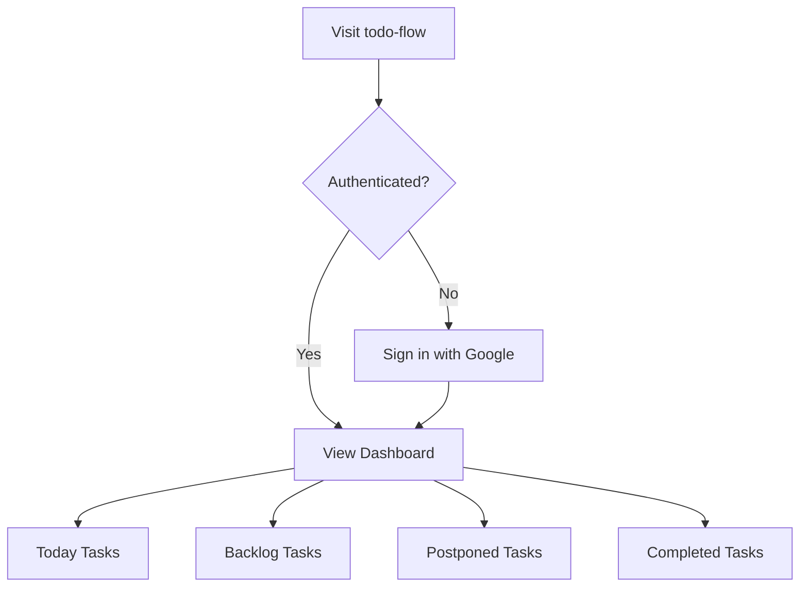
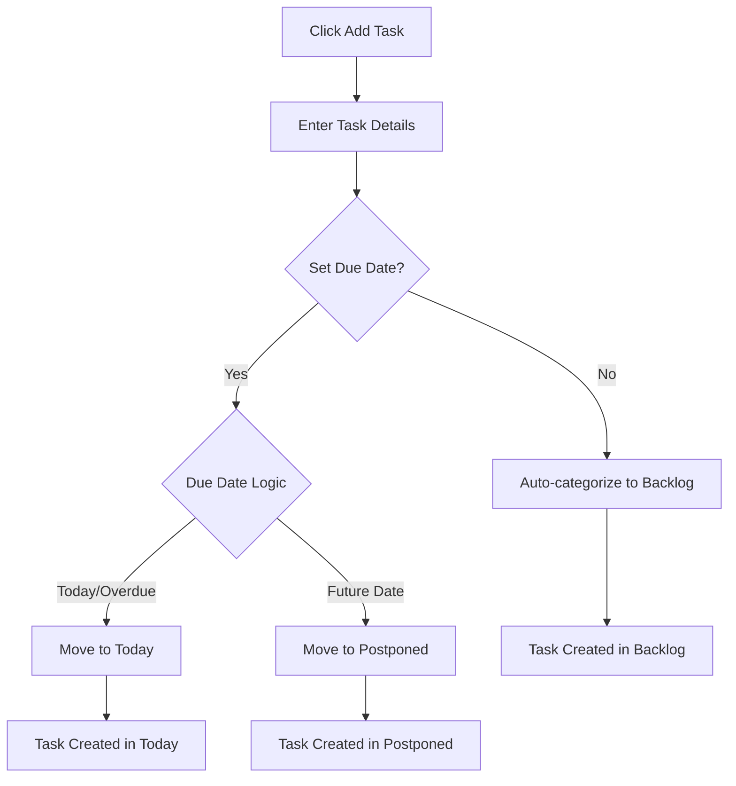
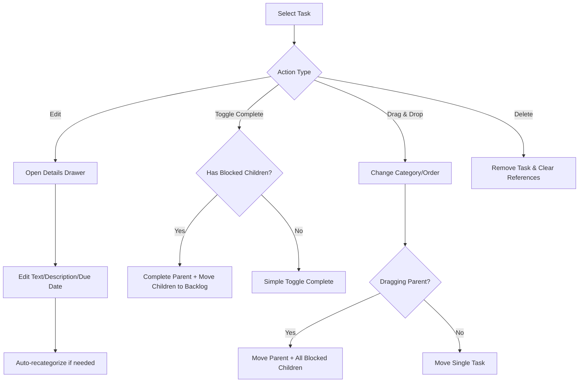
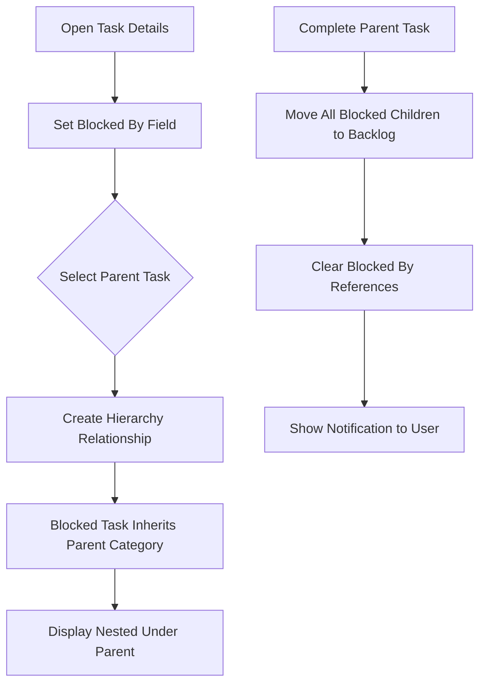
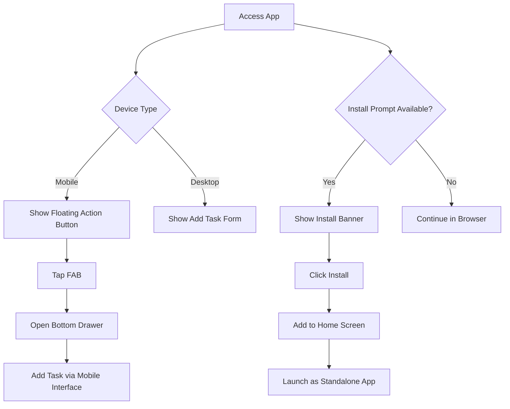

# todo-flow - Progressive Web App

A powerful, intelligent todo app with smart categorization, task hierarchies, and seamless cross-device sync. Built as a modern PWA for optimal mobile and desktop experience.

## TODO 
[ ] Add support for tool calling from chat gpt agent (OR MCP server when chat supports it) to manage tasks from within chatgpt
(api-key auth)
 https://github.com/cameronking4/chat-with-firestore-chatgpt-action/blob/main/app/api/firestore/route.ts
 
[ ] today's todo red, amount indicator like all messages apps do - especially for PWA or Desktop app ICON

[ ] for PWA app, refresh the app data when you just open it (the page is not refreshed) mostly for automation to kick it

[ ] add ultra-focus at the top, editable field that reminds you about your top focus

[ ] d&d nested elements should take these nested elements with drag (now it takes just the parent and child stays in the same position strangely when dragging)

[ ] numbers in task name should be highlighted as links, when you click on it on mobile, then you should call it

[ ] get rid of preview when you edit description of a given task

## ✨ Key Features

### Smart Task Management
- **Auto-Categorization**: Tasks automatically organized into Today, Backlog, and Postponed based on due dates
- **Task Dependencies**: Create hierarchical task relationships with blocking dependencies
- **Drag & Drop**: Intuitive reordering with automatic category updates
- **Rich Descriptions**: Support for detailed task descriptions with clickable links

### Intelligent Organization
- **Today**: Overdue and today's tasks with their dependent subtasks
- **Backlog**: Tasks without due dates and their blocked children
- **Postponed**: Future-dated tasks grouped by date (collapsible)
- **Auto-Migration**: Postponed tasks automatically move to Today when due

### Mobile-First Design
- **Responsive UI**: Optimized for both mobile and desktop
- **Floating Action Button**: Quick task creation on mobile devices
- **Bottom Drawer**: Swipeable task creation interface
- **Touch-Friendly**: Material Design with intuitive gestures

### Progressive Web App
- **Installable**: Add to home screen like a native app
- **Offline Support**: Works without internet connection
- **Background Sync**: Automatic synchronization when online
- **App-like Experience**: Standalone mode without browser UI

### Enhanced UX
- **Real-time Sync**: Instant updates across all devices
- **Audio Feedback**: Pleasant completion sounds
- **Haptic Feedback**: Tactile responses on mobile devices
- **Smooth Animations**: Contextual animations for task state changes
- **Visual Hierarchy**: Clear organization with nested task display

## 🚀 Getting Started

### For Users
1. Visit the app URL in your browser
2. Sign in with your Google account
3. Install the PWA when prompted for the best experience
4. Start creating and organizing your tasks!

### For Developers

1. **Clone and install:**
   ```bash
   git clone <repository-url>
   cd todo-flow
   npm install
   ```

2. **Firebase Setup:**
   - Create a Firebase project with Authentication and Realtime Database
   - Update `src/firebase/config.ts` with your configuration
   - Configure database rules for user isolation

3. **Run locally:**
   ```bash
   npm start
   ```

## 🏃‍♂️ Build & Development

```bash
# Install dependencies
npm install

# Start development server
npm start

# Build for production
npm run build

# Run tests
npm test

# Serve production build locally
npx serve -s build
```

### Development Notes
- App runs on `http://localhost:3000` by default
- Hot reload enabled for development
- Service worker only active in production builds
- Firebase configuration required for full functionality

## 📁 Project Structure

```
src/
├── components/
│   ├── Login.tsx                    # Authentication component
│   ├── PWAInstallPrompt.tsx         # PWA installation handler
│   ├── TodoList.tsx                 # Main todo orchestration
│   └── todo/
│       ├── AddTodoForm.tsx          # Task creation form
│       ├── CompletedTodosSection.tsx # Completed tasks display
│       ├── NestedTodoSection.tsx    # Hierarchical task rendering
│       ├── TodoDetailsDrawer.tsx    # Task editing drawer
│       ├── TodoItem.tsx             # Individual task component
│       ├── TodoSection.tsx          # Category sections
│       └── UserHeader.tsx           # User info display
├── hooks/
│   ├── useTodos.ts                  # State management & auto-migration
│   └── useTodoOperations.ts         # CRUD operations & drag-drop
├── services/
│   └── todoService.ts               # Firebase operations layer
├── utils/
│   ├── todoUtils.ts                 # Business logic & categorization
│   ├── dateUtils.ts                 # Date formatting functions
│   ├── feedbackUtils.ts             # Audio & haptic feedback
│   └── linkUtils.tsx                # URL detection & rendering
├── types/
│   └── todo.ts                      # TypeScript interfaces
├── firebase/
│   └── config.ts                    # Firebase configuration
├── theme/
│   └── theme.ts                     # Material-UI theme
├── App.tsx                          # Root application component
└── index.tsx                        # Application entry point

public/
├── manifest.json                    # PWA manifest
├── sw.js                           # Service worker
├── sounds/
│   └── task-completed.mp3          # Completion sound
└── icon-*.svg                      # PWA icons
```

## 🛠️ Tech Stack

- **Frontend**: React 18 + TypeScript
- **UI Framework**: Material-UI v5 (MUI)
- **Backend**: Firebase Authentication + Realtime Database
- **State Management**: Custom hooks with real-time synchronization
- **Drag & Drop**: Hello Pangea DnD (@hello-pangea/dnd)
- **PWA**: Service Worker + Web App Manifest
- **Animations**: Animate.css + custom CSS animations
- **Audio**: Web Audio API for completion sounds
- **Build Tool**: Create React App

## 🏗️ Architecture

- **Services Layer**: Centralized Firebase operations (TodoService)
- **Custom Hooks**: State management (useTodos) and operations (useTodoOperations)  
- **Utilities**: Business logic, date formatting, feedback, and link handling
- **Components**: UI-focused components with delegated business logic
- **Real-time Sync**: Firebase listeners for cross-device synchronization

## 📱 PWA Installation

The app automatically prompts for installation on supported browsers. Once installed:
- Launch from home screen like a native app
- Works offline with cached data
- Receives background updates
- Integrates with device notifications (future)

## 🔄 User Flow Diagrams

### Authentication & Dashboard Access


### Task Creation Flow


### Task Management Operations


### Task Dependencies & Hierarchy


### PWA Installation & Mobile Experience


## 🔧 Core Concepts

### Task Categories
- **Today**: Due today or overdue tasks
- **Backlog**: Tasks without specific due dates
- **Postponed**: Future-dated tasks

### Task Dependencies
- Tasks can be blocked by other tasks
- Blocked tasks appear nested under their parent
- Completing a parent moves blocked children to backlog
- Dragging a parent automatically moves all blocked children

### Data Model
```typescript
Todo {
  id: string
  text: string
  completed: boolean
  category: 'today' | 'backlog' | 'postponed'
  dueDate?: string  // ISO date format
  description?: string
  blockedBy?: string  // ID of blocking task
  order: number
  timestamp: number
}
```

## 🔒 Security

- User authentication required for all operations
- Data isolation per user account
- Secure Firebase rules prevent cross-user access

## 📄 License

MIT License 
